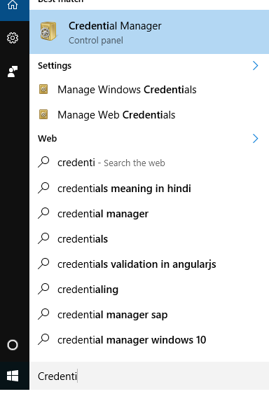
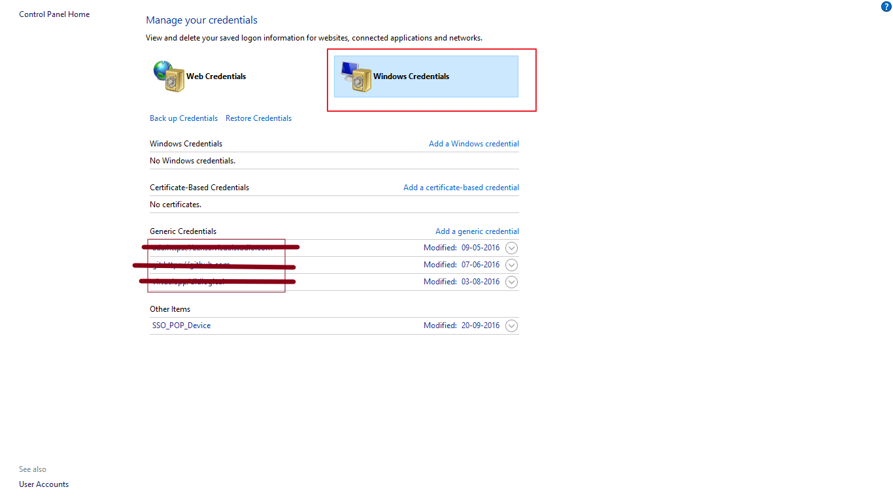

# Forget user credentials

## [StackOverflow](https://stackoverflow.com/a/39608906)

If this problem comes on a Windows machine, do the following.

* Open "Start"
* Go to "Credential Manager"

* Go to "Windows Credentials"
* Delete the entries under Generic Credentials that are related to "git"

* Try connecting again. This time, it should prompt you for the correct username and password

