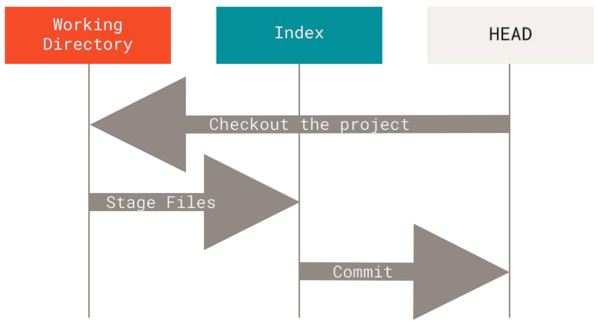

# Git Basics

## Download Git CLI

[Download Git For Windows](https://git-scm.com/download/win)

## Initialize a local `.git` via `git init`

1. Open vscode to create a new project.
1. Create an `index.html` and initialize it with the following content:
 	```html
	 <!DOCTYPE html>
	 <html lang="en">
	 <head>
	     <meta charset="UTF-8">
	     <meta http-equiv="X-UA-Compatible" content="IE=edge">
	     <meta name="viewport" content="width=device-width, initial-scale=1.0">
	     <title>Document</title>
	 </head>
	 <body>
	     <h2>Hello</h2>
	 </body>
	 </html>
	```

1. Open *cmd.exe* in the current folder.
1. Use `git init` command to initialize a new `.git` folder in the root directory of the project:
	```
	git init
	```
	> `.git` is a hidden folder that stores all of the local configurations and logs of your local commits.

---

## Explanation git trees: HEAD, Index, Working Directory

After the `git init` command, you have created the `.git` folder in the root directory.
This folder, stores 3 trees *git* uses to backup your data.

- **Working Directory**
Stores your files you write at the moment, that you didn't save yet.
- **Index**
Stores your files that you `add`ed to it (Also known as *staged files* / *tracked files*).
	- You may `add` specific files / folders / all files and folders, so they will be stored in the *Index* tree.
- **HEAD**
Stores your files that were in the *Index* tree and were `commit`ed.



---
## Let's view our files *status* and see on which tree it is at
> We are expecting to be currently in the *Working Directory* tree.
```
git status
```
You will see the following output:
```
On branch master

No commits yet

Untracked files:
  (use "git add <file>..." to include in what will be committed)
        index.html
```
---

## Let's `add` all our files in the root folder to the *Index* tree

```
git add .
```

Now the files are also placed in the *Index* tree.

Let's view their status now:
```
git status
```

Will result with the following output:

```
On branch master

No commits yet

Changes to be committed:
  (use "git rm --cached <file>..." to unstage)
        new file:   index.html
```

---

## Configure Settings For Git To Use Vscode As The Default Editor

- ### Configure `--global` settings
	Run the command:
	```
	git config --global --edit
	```
	and add the following lines:
	```
	[core]
	  editor = code -w -n
	[diff]
	  tool = vscode
	[difftool "vscode"]
	  cmd = code -w -n --diff $LOCAL $REMOTE
	[merge]
	  tool = vscode
	[mergetool "vscode"]
	  cmd = code -w -n $MERGED
	```

## Let's `commit` the files:
```
git commit
```
Write the following lines,
such that the title of the commit message is at the first line, and the body of the message starts at the 3rd line.
> Keep the maximum width of the commit message to be 50.

```
Added A New HTML Template

- Added [index.html](index.html) as a new HTML
  template for this tutorial.

```

After you wrote your message, exit the window. And this will create the new commit.


You may now see that `git status` will show that you have nothing to commit.

---

## Use `git log` to view all the history of commits in the current branch until the HEAD.

```
git log
```
---

## Connect to the repository in Github

Create a new repository on Github.

Copy the url of the repository,
and run the command:

```
git remote add origin <URL_OF_REPOSITORY>
```

> - `origin` is the arbitrary default name of the repository.

### Check you are connected to the remote repository

```
git remote -v
```
> NOTE: If you want to disconnect from the `origin` remote, you need to run:
>	```
>	git remote remove origin
>	```

---

## Now let's create a new feature for our project

We are now (by default) in the `master` branch.
We should create a new branch for our new feature, to develop it there. And after we finished developing it, we will create a *"Pull Request"* to `merge` our new feature we have developed from the new branch we have made to the `master` branch.


### Create a new local-branch for your feature:
```
git checkout -b adding-button-to-index
```
We have `checkout`ed to the new branch.
> `checkout` means that we have *switched* our HEAD to there.

> NOTE: 
> - To view all the local-branches run:
> ```
> git branch
> ```
> - To view al the branches (including the remote), run:
> ```
> git branch -a
> ```


### Create our feature
Now we will make some changes to our `index.html` file.

For example, our file will look like this now:

```html
<!DOCTYPE html>
<html lang="en">
<head>
    <meta charset="UTF-8">
    <meta http-equiv="X-UA-Compatible" content="IE=edge">
    <meta name="viewport" content="width=device-width, initial-scale=1.0">
    <title>Document</title>
</head>
<body>
    <h2>Hello2</h2>
    <button>Test</button>
</body>
</html>
```

You can now `git add` the changes the the *Index* tree, and then `git commit` them to the *HEAD* tree of the `adding-button-to-index` local-branch.

## View the difference between HEADs

Since you have committed the changes, you may now view the difference you have made that are placed in the HEAD of local-`adding-button-to-index` against the HEAD of the local-`master` branch.

- View the difference via CLI:
	```
	git diff master
	```
- View the difference via Vscode:
	```
	git difftool master
	```

---

## `push` a local-branch to the remote

Now, let's `push` the last commit of `adding-button-to-index` to the `origin` remote repository (which is Github).


```
git push
```

> On the first `push` you need to run:
> ```
> git push --set-upstream origin adding-button-to-index
> ```

~~> NOTE: on the first `push` of the current branch, preparing to set `origin/adding-button-to-index` as its remote (`origin/adding-button-to-index` is a new branch that will be created in the remote repository right after your `push` command.)~~

this will result with the following output (for example)

```
PS E:\Tal\Excercises\Git\Git-Tutorial> git push --set-upstream origin adding-button-to-index
Enumerating objects: 6, done.
Counting objects: 100% (6/6), done.
Delta compression using up to 8 threads
Compressing objects: 100% (4/4), done.
Writing objects: 100% (6/6), 786 bytes | 786.00 KiB/s, done.
Total 6 (delta 1), reused 0 (delta 0), pack-reused 0
remote: Resolving deltas: 100% (1/1), done.
remote:
remote: Create a pull request for 'adding-button-to-index' on GitHub by visiting:
remote:      https://github.com/taljacob2/git-tutorial/pull/new/adding-button-to-index
remote:
To https://github.com/taljacob2/git-tutorial
 * [new branch]      adding-button-to-index -> adding-button-to-index
Branch 'adding-button-to-index' set up to track remote branch 'adding-button-to-index' from 'origin'.
```

## Creating a "Pull Request" (Also known as: "PR") to merge to the `origin/master` branch


Now, you will see in the output received, that Github has generated a new "Pull Request" link for you:
```
https://github.com/taljacob2/git-tutorial/pull/new/adding-button-to-index
```
Click it, and it will lead you to the generated "Pull Request". You can review the code there before merging it to the `master` branch.

## Merge Without A "Pull Request"

You may merge to the `master` branch without a pull request, like so:

First, you should checkout to the `master` branch.
```
git checkout master
```

And then you merge the `adding-button-to-index` branch into the `master` branch:
```
git merge adding-button-to-index
```

Keep in mind that the "merged result" that is now in the `master` branch is presented only in your **local**-`master` branch.
So if you want to `push` the changes to `origin` remote, you should do so:
```
git push
```
> On the first `push` you need to run:
> ```
> git push --set-upstream master
> ```


You may view the `git status` or `git log` afterwards, to make sure everything went fine.

